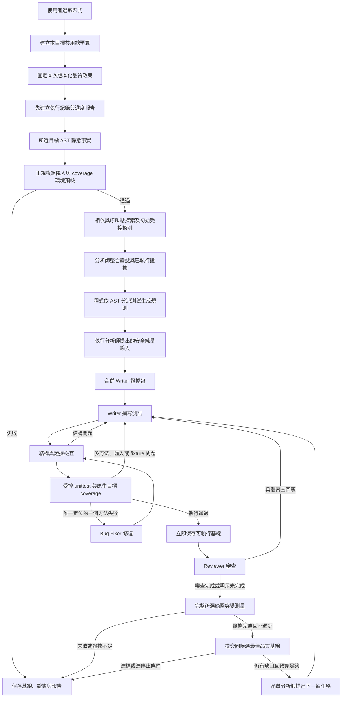

# 專案閱讀入口

先看本頁，再依「想改什麼」打開對應檔案。角色提示詞只有一份正式實作，集中在 `src/roles/`。

本頁描述目前工作區已接線的路徑，不表示 [完整完善計畫](docs/專案完善計畫_2026_09_21.md) 已全部完成。第一批 P0、Trace 觀測、突變／coverage 與總預算已交付；完成範圍、未關閉問題與正式測試結果以 [實作與驗收追蹤](docs/完善實作進度_2026_09_21.md) 為準。

## 為什麼有 TypeScript 和 Python？

- `src/`：在 VS Code 中執行，負責介面、模型請求、角色交接與報告。
- `python_scripts/`：由指定的 Python 虛擬環境執行，負責 Python AST、受控行為探測與測試工具。
- `src/roles/`：屬於 `src/` 的子目錄，放模型角色的提示詞與回應解析；它不是第三套執行系統。

兩種語言透過子程序參數／標準輸入傳遞資料。Python 分析工具回傳 JSON，unittest 保留執行報告；正式 target coverage 與 mutation 以結構化證據交給 TypeScript 驗證，不能從顯示用百分比推定成功。

## 主流程

Python 環境準備由 `pythonEnvironmentController.ts` 選擇整個專案、資料夾或單一 Python 檔案，分別保存最近選擇。資料夾／專案模式經 `environment_probe.py` 呼叫 `dependency_inventory.py`，只以 AST 盤點所選樹內 import，依所選 Python 的標準庫與頂層套件位置彙整缺項；不執行應用或外部套件的 import。`dependencyInventory.ts` 驗證並呈現 `dependency-inventory-v1` 報告，保留逐檔行號、條件／可選／型別相依、首次與最近缺項及不完整掃描原因。必要缺項沿用原有 requirements／明確 packageMappings 安裝流程；條件缺項只列出。靜態可找到套件不代表正式模組載入成功，原有單檔隔離預檢與測試 gate 不變。詳細操作及範圍限制見 [專案相依掃描](docs/Python相依掃描.md)。

補裝前由 `pythonInstallationPlan.ts` 彙整目前缺項、明確映射、requirements 與工具宣告，`pythonInstallationPreview.ts` 提供獨立清單頁面。使用者確認的計畫綁定 Python、安裝操作與本機 requirements／引用／constraint 檔案 hash；安裝前再次核對，取消或未確認時不執行 pip。新增缺項重新預覽；初次清單會一次列出資料夾掃描的所有已知必要缺項。未知映射、無法讀取或範圍外引用不可批准。來源網址與任意原文不進入頁面／Markdown 報告，直接宣告與 pip 後續解析的間接相依分開說明。原有 interpreter 選擇、隔離載入與安裝後驗證仍保留。

修復失敗以 `repair-diagnostics-v1` 記錄於 `role_events.jsonl`。Bug Fixer 的格式／合併拒絕由 `mergeBugFixReplacementDetailed` 產生原因碼與詞法結構統計；Python `validate_repair_scope.py` 另回傳 AST 範圍原因碼。兩者不改變既有接受規則。`AnalysisJournal` 即時保存首次／最近修復診斷與分類計數，主流程同步寫入 `final_report.md`，並以獨立 `repair-routing` 事件記錄後續修訂、降階或停止。完整模型回覆不進入新增診斷；使用回覆／候選 hash 與原事件 sequence 追溯，詳見 [失敗診斷紀錄](docs/失敗診斷紀錄_2026_09_21.md)。

Reviewer 無法完成時會保留「審查未完成」，工具驗證仍可執行，但不因此宣稱品質達標。所有模型建議都是待驗證假設。

Trace 現在由 `trace_case_worker.py` 每案建立新 Python 程序，`trace_value_codec.py` 保存 target 與 constructor 呼叫前後的有限型態快照。`behavior-observations-v2` 保留 run／case ID、來源、耗時、returned／raised／blocked／setup_error／timeout／not_started／worker_error 等逐案狀態，JSONL 可恢復已完成觀測。`behaviorObservations.ts` 驗證 tagged schema、容量、唯一 ID 與 outcome 配對；cycle、shared-reference、未知物件及截斷值只算不可重播診斷。合併初始／補充觀測時保留 kwargs 順序，相同呼叫的矛盾結果不可作精確斷言。完整快照留在產物；`observationsForPrompt` 提供斷言事實與案例識別，避免把重複序列化資料塞進角色提示。

caller AST 現在先以同一 codec 編碼整筆 `args`／`kwargs` 與已證明的 constructor 輸入，經 `probeInputs.ts` 的 `probe-inputs-v1` envelope 交給 `probe_input_transport.py` 解碼，保留 tuple、bytes、非字串 dict key、大整數、float 與順序。無法靜態求值、超限與非法案例保留診斷；新 typed 欄位不合法時不能降回舊 JSON 猜測。Tier 2 比對完整呼叫與 constructor，Tier 1 按每筆觀測建立實例。尚未建立完整型態樹或 A/B/C/D 測資規劃；能傳遞已知 literal，不等於能替任意型態建立有效值。set／frozenset 仍不升格為精確 oracle。

`runtime_policy.py` 是 Trace、預檢與正式 runner 共用的執行政策；mutation 經正式 runner 套用。標準 thread 等待與失敗傳遞、codec hook 與必要 linecache 讀取邊界已有具體回歸驗證；直接低階 `_thread` 啟動仍阻擋。程序內防護不代表任意原生擴充或 OS 層級隔離。

`target_invocation.py` 以 canonical source、qualified target 與 code 身分觀測本 candidate 是否真正進入目標。`coverage_read.py` 核對來源／測試 hash、testRunId 與 coverage data hash，從 Coverage API／JSON 取得原生 statements、executed／missing lines 與 branch arcs，再限定 target body。不同路徑的同名檔案不能互認；docstring、多行語句與單行函式以實際資料處理。缺欄位、scope 不明、分支資料未知或過期 invocation 不能通過。舊 coverage 文字 parser 僅供相容讀取，正式流程不以它計分。主程序與本次新建標準 thread 的目標呼叫均納入觀測；替換觀測 hook 不得通過。

`CandidateCheckpointStore` 分開保存 executable 與 quality 基線。通過執行 gate 的候選先存成按 code hash 命名的不可變檔案；只有本候選的完整有效 mutation 才可提交 quality checkpoint。首輪審查／突變失敗仍能開啟可執行測試，未知分數保持 null。rollback 同步還原同版本的測試、案例、執行、coverage、mutation、Tier 與 review 狀態；來源或已解析相依改變時保存歷史成果但使當前證據失效。

`mutationResult.ts` 驗證 `MutationRun` 的來源／測試 hash、operator/scope version、candidateSetId、候選 ID、計數與完成狀態。內建引擎先建立所選函式 body 的完整有效集合，排除 noop／重複／不可編譯變更；正式函式路徑選測全集。TIMEOUT／ERROR／NOT_RUN 不得算 killed，部分測量不可假裝完整，零候選為 N/A；達標使用精確計數而非四捨五入百分比。外部 module-scope 或無法證實的結果不能替代函式分數；真實外部引擎版本矩陣與完整環境身分契約仍待驗收／擴充。

`contracts/quality-policy-v1.json` 是 TypeScript `qualityPolicy.ts` 與 Python `quality_policy.py` 共用的政策定義。正式流程在測量前固定 `strict100-v1`；corpus 使用預先固定的 fixture manifest ID／hash 與原門檻，不依成績換政策。政策以精確比例判定目標行覆蓋、完整分支、完整突變集合及審查來源，分開保存 measurement／policy／review 狀態。checkpoint、批次與 scorecard 核對同一政策、候選與證據後重算 assessment；舊報告保持相容讀取，不自動升格。取消或回合耗盡不因保留了一份好基線而變成整次通過。

`TargetBudget` 透過每目標的 async context 共用總時限、logical requests、transport attempts、估計 input tokens 及 candidate attempts。角色、Tier、格式補正、候選修訂與傳輸重試不能重新取得一份預算，子程序亦受剩餘總時間限制。預設為 10 分鐘、20 次 logical requests、40 次 transport attempts、200,000 估計 input tokens、20 次候選嘗試；這是資源上限，不是付費 tokens 用量或品質達標承諾。能力導向路由與完整 RetryPolicy 拆分仍保留在後續計畫。

正式 unittest／coverage、獨立 Trace baseline 及內建突變試驗透過 `python_scripts/generated_test_runner.py` 執行。這個程序內 guard 阻擋未 mock 的檔案、網路、shell 與非隔離 SQLite，允許 import／traceback 所需工具讀取與獨立記憶體資料庫。安全例外遭吞掉仍不算通過；mutant 隔離錯誤列為 ERROR，整輪不計分。外部引擎使用同一 runner 並回寫每次開始／結束與隔離狀態；紀錄缺少、未完成或違規均拒絕分數，避免安全阻擋被引擎算成 killed。此 guard 補強 AST gate，不是惡意原生程式的作業系統 sandbox。

`review-v7` 保留完整測試語境，只替非空、非註解行提供可引用 ID；模板回聲、明顯不相關的引用，以及帶引號／mocked 詞形的目標修改指令均會被拒絕。`bug-fix-v4` 正式請求改回傳單方法 Python fence，減少 JSON 多行轉義錯誤，仍由 host 合併並經 Python AST 範圍與執行驗證；舊 JSON 只保留解析相容性。資格版本 `python-unittest-v5` 分別以 JSON 審查及文字 Python 修復探測，不升級舊資格。

`review-v7` 把最多五個 findings 的分類、TEST_FILE 行號、原因與動作固定在同一份 schema／parser 契約；程式依行號還原精確原文，缺漏情境不會自行升格為 blocking。明確與目標 binding 矛盾、要求修改來源或 mock 目標本身的回覆保持未完成，不能交 Writer 或轉成通過。這是有界的矛盾檢查，不是模型意見的正確性證明。Writer 修訂保留最新拒絕原因；只有 unittest 唯一列出的一個失敗方法可交 Bug Fixer。Tier 3 scaffold 回傳完整測試檔，不再做第二層 class／縮排包裝。

`src/roles/reviewSession.ts` 以完整審查 prompt 的雜湊重用同候選／同證據評估；連續兩次無法取得合格審查後，停止該目標分析的額外審查請求。Reviewer 格式不合格不再另以文字模式重問；供應商傳輸層錯誤仍遵循既有有限重試。新目標分析重新開始，未知結果絕不改成空問題通過。

`src/pipeline/qualityRegression.ts` 以實測未覆蓋行與分支集合比較候選；部分缺口縮小可保留，新增缺口或已知證據變未知仍回滾。分數與存活突變體的既有保護維持。停滯計數同樣採個別缺口身份，不比較翻譯後的完整清單。

`quality-task-v3` 每輪輪替選出一個實測覆蓋缺口或存活突變體，以穩定 ID 綁定最多一項模型任務。品質分析格式失敗可在相同 deadline 內補正一次，不回填無效回覆；Python-only 模型仍採文字傳輸並接受同一本地 parser。任務僅是假設，實際通過仍由下一輪執行、coverage、mutation 與 Reviewer 決定。

Dummy 標記仍在 AST 前直接略過；Stub 在正規模組匯入通過後走快速通道，未執行的 smoke test 明確記為 `executionVerified: false`。上述圖示描述一般函式。

模組預檢使用與生成測試相同的 Python／匯入路徑，確認正規模組實際指向選取的來源；載入時沿用 Trace 副作用阻擋。缺相依、非法模組名稱、同名模組遮蔽或載入副作用會在模型請求前停止，不降 Tier 重試。初始 Trace 載入錯誤保留診斷，但不能成為例外斷言事實。

預檢失敗快取屬於一次 `ExecutionContext`；同批次相同來源／模組／Python／有序匯入根共用確定性失敗，新分析重新檢查相依。逾時、取消及工具暫時錯誤不快取；並行成功目標各自保留輸出目錄的匯入環境。

`python_scripts/mock_behavior.py` 在結構檢查發現標準 mock 呼叫斷言時，靜態追溯標準庫 Mock、目標使用點 patch 或傳入目標的 mock，以及同一測試內先執行 target 再驗證行為的順序。未知控制流程、重綁定、無關 mock 與未 await 的 async 呼叫不提供證據；此檢查不執行候選，也不替代隔離執行與品質 gate。

`validate_test_bindings.py` 同時拒絕明確替換所選目標／其類別的標準 patch，以及直接 unittest 類別中無 decorator 卻要求額外必填參數的測試方法；後者是 Writer 結構修訂，不應消耗 Bug Fixer。未知 decorator 注入保持執行檢查。

## 生成前的四個交接契約

| 契約 | 產生者 → 使用者 | 內容與證據限制 |
|---|---|---|
| `AnalysisEvidenceV2` | AST／初始行為探測 → 語意分析師 | 目標來源碼雜湊、AST 設定事實、呼叫點、相依來源與已執行 I/O；阻擋操作只算診斷 |
| `SemanticPlanV2` | 語意分析師 → 管線 | 待測情境與安全純量輸入建議，明確標記為模型假設 |
| `RuleSelectionV2` | 確定性規則分派器 → Writer | 依來源碼／AST 選出的規則、觸發行號或 AST 事實與規則版本；模型不能自行加入規則 |
| `WriterEvidenceBundleV3` | 管線 → Writer | 合併初始與補充行為觀測、分析假設及規則選擇，並固定證據優先順序 |

受控行為探測會真的執行函式，但只保存有上限的呼叫參數、回傳值、例外與安全阻擋診斷；它不是逐行 debugger trace。精確斷言只能引用相同呼叫條件下的已執行觀測、可直接證明的來源路徑，或測試內明確設定的 mock 行為。

## 想改什麼，就從哪裡開始

| 需求 | 正式入口 | 下一個閱讀位置 |
|---|---|---|
| 看完整執行流程 | [orchestrator.ts](src/orchestrator.ts) 的 `executeSingleFileAnalysis` | [候選狀態機](src/pipeline/testCandidatePipeline.ts) |
| 準備 Python／查安裝界線 | [pythonEnvironmentController.ts](src/environment/pythonEnvironmentController.ts) | [pythonEnvironmentSetup.ts](src/environment/pythonEnvironmentSetup.ts)、[environment_probe.py](python_scripts/environment_probe.py) |
| 查生成前的環境阻擋 | [modulePreflight.ts](src/pipeline/modulePreflight.ts) | [module_preflight.py](python_scripts/module_preflight.py) |
| 查逐案輸入與 Trace 契約 | [behaviorObservations.ts](src/pipeline/behaviorObservations.ts) | [trace_case_worker.py](python_scripts/trace_case_worker.py)、[trace_value_codec.py](python_scripts/trace_value_codec.py) |
| 查共用執行政策 | [runtime_policy.py](python_scripts/runtime_policy.py) | Trace、preflight、generated runner 的 guard 入口 |
| 查首輪成果保存與回滾 | [candidateCheckpoint.ts](src/pipeline/candidateCheckpoint.ts) | [qualityRegression.ts](src/pipeline/qualityRegression.ts) |
| 查原生 target coverage | [targetCoverage.ts](src/mutation/targetCoverage.ts) | [coverage_read.py](python_scripts/coverage_read.py)、[target_invocation.py](python_scripts/target_invocation.py) |
| 查完整突變結果與候選集合 | [mutationResult.ts](src/mutation/mutationResult.ts) | [basic_mutation_runner.py](python_scripts/basic_mutation_runner.py) |
| 查型態完整的 caller 輸入 | [probeInputs.ts](src/pipeline/probeInputs.ts) | [traceValues.ts](src/pipeline/traceValues.ts)、[probe_input_transport.py](python_scripts/probe_input_transport.py) |
| 查正式與 fixture 品質判定 | [qualityPolicy.ts](src/pipeline/qualityPolicy.ts) | [共用政策](contracts/quality-policy-v1.json)、[quality_policy.py](python_scripts/quality_policy.py) |
| 查總時限與重試成本 | [targetBudget.ts](src/pipeline/targetBudget.ts) | [processRunner.ts](src/utils/processRunner.ts)、主控 `requestBudgeted` |
| 查類別、property 與 import 契約 | [targetContract.ts](src/pipeline/targetContract.ts) | Writer、Reviewer 與 Bug Fixer 的 User Prompt |
| 看五個角色及其契約 | [roles/README.md](src/roles/README.md) | 各角色的提示詞與 parser |
| 改測試生成規則如何選取 | [testRuleDispatcher.ts](src/pipeline/testRuleDispatcher.ts) | [測試生成規則庫](src/prompts/testRuleLibrary.ts) |
| 找某階段使用哪個 Python 工具 | [pythonTools.ts](src/pipeline/pythonTools.ts) | [Python 工具對照](python_scripts/README.md) |
| 查模型連線、快取與資格 | [modelProfileRegistry.ts](src/llm/modelProfileRegistry.ts) | [modelQualification.ts](src/llm/modelQualification.ts) |
| 查斷言證據防護 | [traceAssertionEvidence.ts](src/validation/traceAssertionEvidence.ts) | [防護範圍說明](docs/assertion-evidence.md) |
| 查為什麼回滾或停止 | [analysisJournal.ts](src/pipeline/analysisJournal.ts) | 結果目錄中的 `role_events.jsonl` |
| 改側邊欄 | [SidebarProvider.ts](src/ui/SidebarProvider.ts) | [webviewContent.ts](src/ui/webviewContent.ts) |
| 查回歸測試 | `src/test/`、`python_scripts/test_*.py` | `npm run test:unit` |

`src/prompts/` 只保留共用的測試生成規則、提示詳略與範例，不再放五個角色的轉發檔。`src/roles/legacy/` 只保留舊分流格式支援，不在正式流程內。

## 一次執行的主要結果

| 檔案 | 用途 |
|---|---|
| `final_report.md` | 給人閱讀的結果、失敗原因與品質缺口 |
| `run_manifest.json` | 執行識別、來源版本、模型名稱與執行前固定的 qualityPolicy |
| `role_events.jsonl` | 各角色原始版本、拒絕原因與測量證據 |
| `function_knowledge.json` | 當前接受的基線、分析假設、受控行為觀測、規則選擇與待驗證任務 |
| `executable_<codeHash>.py`、`executable_baseline.json` | 已通過執行的不可變候選與其 review／coverage 等證據，mutation 未測為 null |
| `quality_baseline.json` | 綁定同一測試與有效完整 MutationRun 的品質快照，含政策及可重算的 assessment |
| `trace_<id>.jsonl` | 探測規劃、逐案開始／結束與中斷恢復紀錄 |
| `invocation_<testRunId>.json`、`coverage_<testRunId>.json` | 本次候選的精確目標進入證據與原生 coverage 資料 |
| `loop<n>_mutation.json` | 該輪 scope、候選集合、逐 mutant 終態、計數與測量完成狀態 |

來源或已解析相依變更後，舊證據不能直接沿用。探針資格也綁定探針契約版本與不含憑證的端點識別；過期只代表需要重新驗證，不會自動升格成新的通過紀錄。

環境準備接續 `src/environment/` 的既有流程。明確 Python 設定優先，未設定時優先探索專案／工作區 `.venv`；無 requirements 時缺模組只採明確 package mapping，不直接猜同名 pip 套件。安裝只發生在使用者啟動的環境準備流程，與分析／資格測試互斥。完整 dependency fingerprint、其他 lockfile adapter 與環境支援矩陣仍未完成。

相依來源由預檢程序已載入的 `sys.modules`、模組 origin 與函式定義身分解析；只讀所選來源樹內已確認的 Python 檔案。這讓巢狀專案、relative import 與 namespace package 不必猜測批次根目錄，未知或 re-export 仍明示未解析。

保留候選新增實際 `resolvedTier` 與 `coverage.selectedTarget`（限定目標、可執行行、未覆蓋行、分支狀態），跟隨同一份測試與 rollback 保存。scorecard 以經身分核對的目標行集合計算新結果的 coverage，另保留模組分數；舊報告沿用原範圍，不升級既有成績。

Cloud 的 `llmUnitTest.cloudThinkingMode` 預設 `minimal`，可改 `provider-default`。`GoogleThinkingSession` 僅記住服務實際拒絕的思考選項；所有回退共用原時限。供應商服務錯誤在有限傳輸重試後保存為 `model-api`，不再透過 scaffold、分治或 Tier 降階擴大重試。角色請求事件保存 role 與耗時；HTTP 錯誤內容、reasoning segments、截斷產物不當作測試輸出。

一般函式從 AST 前建立 `running` 紀錄；每個角色事件立即更新進度報告，保存第一個與最近一次拒絕／失敗原因。環境預檢或取消也會保存終態；若程序被外部強制終止，最後的 `running`／stage 是未完成檢查點，不能視為成功。

批次結果使用 `<project>_<日期時分>/<專案相對來源路徑去掉 .py>/<qualified target>/`。同分鐘重跑建立 `__run2` 等新目錄，保留舊候選與失敗報告；不再只因 `final_report.md` 存在就跳過。

`src/pipeline/batchJournal.ts` 在來源掃描前建立 `batch_manifest.json` 與 `batch_summary.md`。整批重跑保留新根目錄（例如 `<project>_<日期時分>__run2`），先保存已發現的全部目標才開始逐項執行。來源／AST 掃描失敗、取消、缺報告與仍在執行明確分開；`complete` 表示清單處理完畢，`allTargetsPassed` 才表示每項完整通過。彙整時核對 run/source/target 與保留測試 hash，未審查、Stub、Dummy 或品質不足不升格為通過。環境問題按缺模組或被阻擋操作／專案相對位置分組，不另發模型請求；選取的獨立輸出資料夾不再被當成批次來源。

測試連線會先分別驗證 Writer 的可執行 Python、Reviewer 的 findings 分類 JSON，以及 Bug Fixer 的單一方法替換。三個狀態各自保存於 model profile 與 manifest；Auto 只使用已通過的角色。生成與修復的模型請求仍受完整本地結構、執行、coverage、mutation gate 約束。

實驗室第一輪小批次由 `test/fixtures/python/lab_batch_manifest.json` 固定五個 category，並以
`python_scripts/lab_batch_plan.py` 驗證每個 category 對應唯一 fixture。它只驗證批次契約，實際
模型生成、coverage 與 mutation 仍由 extension 和 `fixture_scorecard.py` 完成；UI 相依類別可
在實驗室替換成原始目標，但不可混用不同來源的報告。

模型候選合併已驗證 Trace 前，管線先對 runner-owned Trace 做結構／安全檢查，再寫成 `loop*_trace_test.py`，在乾淨 Python 程序獨立執行；只有該基線通過才放入候選。async／generator 使用一般標準庫 import。系統基線失敗會停止，避免反覆交模型修訂同一份被自動還原的程式碼。

Trace 基線明確匯入所選目標，避免 wildcard 遺漏私有名稱。例外使用執行觀測確認的 module／qualname；不可解析的例外不產生 assertion。SQLite 檔案／共享 URI 連線會被 audit gate 阻擋；獨立 `:memory:` 連線另設 authorizer，禁止 ATTACH／VACUUM INTO，遭吞掉的安全例外也不能成為 oracle。

`python_scripts/trace_observation_guard.py` 是 Dynamic Trace 的執行觀測輔助模組。它依 Python profiling 事件與真實 callable 身分記錄標準庫時鐘、熵、共享 RNG 及程序身分讀取，不修改回傳值。未控制的觀測加上 `non_deterministic_operations`、`oracle_reason=uncontrolled-ambient-read` 與不可 assertion 旗標，沿既有 Tier 1／例外／Trace gate 排除；Writer、Reviewer、Bug Fixer 收到控制依賴的指引。明確 seeded 的當次私有 RNG、純函式、純 async 與明確 mock 仍保留可驗證路徑。此機制不是任意程式的純度證明，也不保證追蹤所有原生 extension 內部讀取；獨立基線執行及安全檢查仍是必要 gate。

保留候選的 `reviewStatus` 為 `completed`、`incomplete` 或 deterministic 專用 `not-required`，會隨 rollback 同步還原。工具滿分但審查未完成的終態為 `execution-passed-review-incomplete`。scorecard 查核 journal／manifest 的 runId、來源 hash 與保留測試 hash，採該版本的分數，拒絕未完成審查、stub、running、失敗與未解決品質缺口；不拼接不同輪次最高分。

同模組 helper 檢索由 `ast_extractor.py` 執行，與既有跨檔相依合併供分析角色和 Writer 使用。來源碼是 setup/path 語境，無執行時不得成為 oracle。`src/prompts/compactWriterContext.ts` 負責小模型完整證據與可省略 context 的排序，`verifiedWriterExamples.ts` 提供經回歸執行的中性範例；`promptBudget.ts` 統一 M/B 參數量、輸入預算與 Ollama context 設定。所有正式角色請求均先檢查完整提示預算，並記錄估計 tokens 與 logical request 耗時。Reviewer 拒絕帶穩定 diagnostics，完成 gate 維持不變。實作範圍與實驗室驗收見 [Writer 檢索與模型相容性](docs/Writer檢索與模型相容性_2026_09_17.md)。

## 尚未實作與尚待驗收的界線

本輪沒有完成型態樹、型態 A/B/C/D 測資規劃、受限制 setup／Mock adapter、多步狀態案例、逐案 coverage 回饋、完整 TargetSpec、case-delta 生成、survivor 選測／快取，以及逐筆輸入 UI／設定遷移。Writer 仍使用現有完整 Python fence 契約，不能把新增 checkpoint 或 codec 說成已完成增量生成。runtime policy 僅支援受管理的 `threading.Thread`；直接低階 `_thread` 啟動受阻擋，程序內防護不等同 OS sandbox。

共用版本化 `QualityPolicy` 亦未交付；正式 strict100 與 fixture manifest 的不同門檻尚未統一為明確政策欄位。現有 gate 不降低，N/A、未知、未完成審查與未完成測量不因此升格通過。固定模型 A/B、完整 corpus／保留評估集，以及外部引擎的真實支援環境驗收均未執行。

CI workflow 已設定 Windows／Ubuntu 與 Python 3.12／3.13 矩陣；設定存在不代表遠端工作已成功。本輪本機 Node 392／Python 200 項、型別、lint、生產 build、Webview 及 secret scan 均通過；遠端 CI 與模型／外部引擎實驗仍待驗收，詳見實作追蹤文件。
