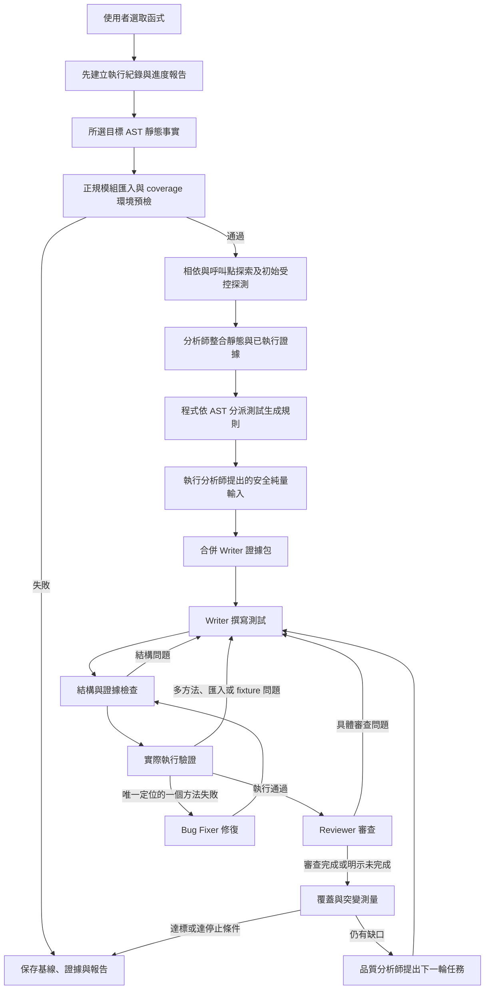

# 專案閱讀入口

先看本頁，再依「想改什麼」打開對應檔案。角色提示詞只有一份正式實作，集中在 `src/roles/`。

## 為什麼有 TypeScript 和 Python？

- `src/`：在 VS Code 中執行，負責介面、模型請求、角色交接與報告。
- `python_scripts/`：由指定的 Python 虛擬環境執行，負責 Python AST、受控行為探測與測試工具。
- `src/roles/`：屬於 `src/` 的子目錄，放模型角色的提示詞與回應解析；它不是第三套執行系統。

兩種語言透過子程序參數／標準輸入傳遞資料。Python 分析工具回傳 JSON；unittest 與 coverage 回傳執行報告。TypeScript 決定結果能否進入下一階段。

## 主流程

Reviewer 無法完成時會保留「審查未完成」，工具驗證仍可執行，但不因此宣稱品質達標。所有模型建議都是待驗證假設。

`review-v5` 把最多五個 findings 的分類、原文、原因與動作固定在同一份 schema／parser 契約；缺漏情境不會自行升格為 blocking。Writer 修訂保留最新拒絕原因；只有 unittest 唯一列出的一個失敗方法可交 Bug Fixer。Tier 3 scaffold 回傳完整測試檔，不再做第二層 class／縮排包裝。

`src/roles/reviewSession.ts` 以完整審查 prompt 的雜湊重用同候選／同證據評估；連續兩次無法取得合格審查後，停止該目標分析的額外審查請求。Reviewer 格式不合格不再另以文字模式重問；供應商傳輸層錯誤仍遵循既有有限重試。新目標分析重新開始，未知結果絕不改成空問題通過。

Dummy 標記仍在 AST 前直接略過；Stub 在正規模組匯入通過後走快速通道，未執行的 smoke test 明確記為 `executionVerified: false`。上述圖示描述一般函式。

模組預檢使用與生成測試相同的 Python／匯入路徑，確認正規模組實際指向選取的來源；載入時沿用 Trace 副作用阻擋。缺相依、非法模組名稱、同名模組遮蔽或載入副作用會在模型請求前停止，不降 Tier 重試。初始 Trace 載入錯誤保留診斷，但不能成為例外斷言事實。

預檢失敗快取屬於一次 `ExecutionContext`；同批次相同來源／模組／Python／有序匯入根共用確定性失敗，新分析重新檢查相依。逾時、取消及工具暫時錯誤不快取；並行成功目標各自保留輸出目錄的匯入環境。

`python_scripts/mock_behavior.py` 在結構檢查發現標準 mock 呼叫斷言時，靜態追溯標準庫 Mock、目標使用點 patch 或傳入目標的 mock，以及同一測試內先執行 target 再驗證行為的順序。未知控制流程、重綁定、無關 mock 與未 await 的 async 呼叫不提供證據；此檢查不執行候選，也不替代隔離執行與品質 gate。

## 生成前的四個交接契約

| 契約 | 產生者 → 使用者 | 內容與證據限制 |
|---|---|---|
| `AnalysisEvidenceV2` | AST／初始行為探測 → 語意分析師 | 目標來源碼雜湊、AST 設定事實、呼叫點、相依來源與已執行 I/O；阻擋操作只算診斷 |
| `SemanticPlanV2` | 語意分析師 → 管線 | 待測情境與安全純量輸入建議，明確標記為模型假設 |
| `RuleSelectionV2` | 確定性規則分派器 → Writer | 依來源碼／AST 選出的規則、觸發行號或 AST 事實與規則版本；模型不能自行加入規則 |
| `WriterEvidenceBundleV3` | 管線 → Writer | 合併初始與補充行為觀測、分析假設及規則選擇，並固定證據優先順序 |

受控行為探測會真的執行函式，但只保存有上限的呼叫參數、回傳值、例外與安全阻擋診斷；它不是逐行 debugger trace。精確斷言只能引用相同呼叫條件下的已執行觀測、可直接證明的來源路徑，或測試內明確設定的 mock 行為。

## 想改什麼，就從哪裡開始

| 需求 | 正式入口 | 下一個閱讀位置 |
|---|---|---|
| 看完整執行流程 | [orchestrator.ts](src/orchestrator.ts) 的 `executeSingleFileAnalysis` | [候選狀態機](src/pipeline/testCandidatePipeline.ts) |
| 查生成前的環境阻擋 | [modulePreflight.ts](src/pipeline/modulePreflight.ts) | [module_preflight.py](python_scripts/module_preflight.py) |
| 查類別、property 與 import 契約 | [targetContract.ts](src/pipeline/targetContract.ts) | Writer、Reviewer 與 Bug Fixer 的 User Prompt |
| 看五個角色及其契約 | [roles/README.md](src/roles/README.md) | 各角色的提示詞與 parser |
| 改測試生成規則如何選取 | [testRuleDispatcher.ts](src/pipeline/testRuleDispatcher.ts) | [測試生成規則庫](src/prompts/testRuleLibrary.ts) |
| 找某階段使用哪個 Python 工具 | [pythonTools.ts](src/pipeline/pythonTools.ts) | [Python 工具對照](python_scripts/README.md) |
| 查模型連線、快取與資格 | [modelProfileRegistry.ts](src/llm/modelProfileRegistry.ts) | [modelQualification.ts](src/llm/modelQualification.ts) |
| 查斷言證據防護 | [traceAssertionEvidence.ts](src/validation/traceAssertionEvidence.ts) | [防護範圍說明](docs/assertion-evidence.md) |
| 查為什麼回滾或停止 | [analysisJournal.ts](src/pipeline/analysisJournal.ts) | 結果目錄中的 `role_events.jsonl` |
| 改側邊欄 | [SidebarProvider.ts](src/ui/SidebarProvider.ts) | [webviewContent.ts](src/ui/webviewContent.ts) |
| 查回歸測試 | `src/test/`、`python_scripts/test_*.py` | `npm run test:unit` |

`src/prompts/` 只保留共用的測試生成規則、提示詳略與範例，不再放五個角色的轉發檔。`src/roles/legacy/` 只保留舊分流格式支援，不在正式流程內。

## 一次執行的四份結果

| 檔案 | 用途 |
|---|---|
| `final_report.md` | 給人閱讀的結果、失敗原因與品質缺口 |
| `run_manifest.json` | 執行識別、來源版本與模型名稱 |
| `role_events.jsonl` | 各角色原始版本、拒絕原因與測量證據 |
| `function_knowledge.json` | 當前接受的基線、分析假設、受控行為觀測、規則選擇與待驗證任務 |

來源或已解析相依變更後，舊證據不能直接沿用。探針資格也綁定探針契約版本與不含憑證的端點識別；過期只代表需要重新驗證，不會自動升格成新的通過紀錄。

相依來源由預檢程序已載入的 `sys.modules`、模組 origin 與函式定義身分解析；只讀所選來源樹內已確認的 Python 檔案。這讓巢狀專案、relative import 與 namespace package 不必猜測批次根目錄，未知或 re-export 仍明示未解析。

保留候選新增實際 `resolvedTier` 與 `coverage.selectedTarget`（限定目標、可執行行、未覆蓋行、分支狀態），跟隨同一份測試與 rollback 保存。scorecard 以經身分核對的目標行集合計算新結果的 coverage，另保留模組分數；舊報告沿用原範圍，不升級既有成績。

Cloud 的 `llmUnitTest.cloudThinkingMode` 預設 `minimal`，可改 `provider-default`。`GoogleThinkingSession` 僅記住服務實際拒絕的思考選項；所有回退共用原時限。供應商服務錯誤在有限傳輸重試後保存為 `model-api`，不再透過 scaffold、分治或 Tier 降階擴大重試。角色請求事件保存 role 與耗時；HTTP 錯誤內容、reasoning segments、截斷產物不當作測試輸出。

一般函式從 AST 前建立 `running` 紀錄；每個角色事件立即更新進度報告，保存第一個與最近一次拒絕／失敗原因。環境預檢或取消也會保存終態；若程序被外部強制終止，最後的 `running`／stage 是未完成檢查點，不能視為成功。

批次結果使用 `<project>_<日期時分>/<專案相對來源路徑去掉 .py>/<qualified target>/`。同分鐘重跑建立 `__run2` 等新目錄，保留舊候選與失敗報告；不再只因 `final_report.md` 存在就跳過。

測試連線會先分別驗證 Writer 的可執行 Python、Reviewer 的 findings 分類 JSON，以及 Bug Fixer 的單一方法替換。三個狀態各自保存於 model profile 與 manifest；Auto 只使用已通過的角色。生成與修復的模型請求仍受完整本地結構、執行、coverage、mutation gate 約束。

實驗室第一輪小批次由 `test/fixtures/python/lab_batch_manifest.json` 固定五個 category，並以
`python_scripts/lab_batch_plan.py` 驗證每個 category 對應唯一 fixture。它只驗證批次契約，實際
模型生成、coverage 與 mutation 仍由 extension 和 `fixture_scorecard.py` 完成；UI 相依類別可
在實驗室替換成原始目標，但不可混用不同來源的報告。

模型候選合併已驗證 Trace 前，管線先對 runner-owned Trace 做結構／安全檢查，再寫成 `loop*_trace_test.py`，在乾淨 Python 程序獨立執行；只有該基線通過才放入候選。async／generator 使用一般標準庫 import。系統基線失敗會停止，避免反覆交模型修訂同一份被自動還原的程式碼。

Trace 基線明確匯入所選目標，避免 wildcard 遺漏私有名稱。例外使用執行觀測確認的 module／qualname；不可解析的例外不產生 assertion。SQLite 檔案／共享 URI 連線會被 audit gate 阻擋；獨立 `:memory:` 連線另設 authorizer，禁止 ATTACH／VACUUM INTO，遭吞掉的安全例外也不能成為 oracle。

保留候選的 `reviewStatus` 為 `completed`、`incomplete` 或 deterministic 專用 `not-required`，會隨 rollback 同步還原。工具滿分但審查未完成的終態為 `execution-passed-review-incomplete`。scorecard 查核 journal／manifest 的 runId、來源 hash 與保留測試 hash，採該版本的分數，拒絕未完成審查、stub、running、失敗與未解決品質缺口；不拼接不同輪次最高分。

同模組 helper 檢索由 `ast_extractor.py` 執行，與既有跨檔相依合併供分析角色和 Writer 使用。來源碼是 setup/path 語境，無執行時不得成為 oracle。`src/prompts/compactWriterContext.ts` 負責小模型完整證據與可省略 context 的排序，`verifiedWriterExamples.ts` 提供經回歸執行的中性範例；`promptBudget.ts` 統一 M/B 參數量、輸入預算與 Ollama context 設定。所有正式角色請求均先檢查完整提示預算，並記錄估計 tokens 與 logical request 耗時。Reviewer 拒絕帶穩定 diagnostics，完成 gate 維持不變。實作範圍與實驗室驗收見 [Writer 檢索與模型相容性](docs/Writer檢索與模型相容性_2026_09_17.md)。
