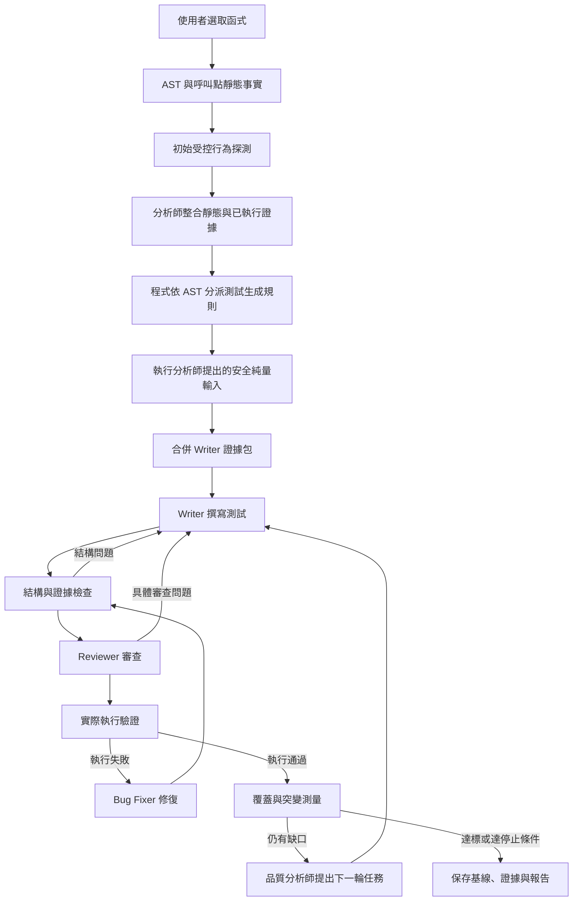

# 專案閱讀入口

先看本頁，再依「想改什麼」打開對應檔案。角色提示詞只有一份正式實作，集中在 `src/roles/`。

## 為什麼有 TypeScript 和 Python？

- `src/`：在 VS Code 中執行，負責介面、模型請求、角色交接與報告。
- `python_scripts/`：由指定的 Python 虛擬環境執行，負責 Python AST、受控行為探測與測試工具。
- `src/roles/`：屬於 `src/` 的子目錄，放模型角色的提示詞與回應解析；它不是第三套執行系統。

兩種語言透過子程序參數／標準輸入傳遞資料。Python 分析工具回傳 JSON；unittest 與 coverage 回傳執行報告。TypeScript 決定結果能否進入下一階段。

## 主流程

Reviewer 無法完成時會保留「審查未完成」，工具驗證仍可執行，但不因此宣稱品質達標。所有模型建議都是待驗證假設。

## 生成前的四個交接契約

| 契約 | 產生者 → 使用者 | 內容與證據限制 |
|---|---|---|
| `AnalysisEvidenceV2` | AST／初始行為探測 → 語意分析師 | 目標來源碼雜湊、AST 設定事實、呼叫點、相依來源與已執行 I/O；阻擋操作只算診斷 |
| `SemanticPlanV2` | 語意分析師 → 管線 | 待測情境與安全純量輸入建議，明確標記為模型假設 |
| `RuleSelectionV2` | 確定性規則分派器 → Writer | 依來源碼／AST 選出的規則、觸發行號或 AST 事實與規則版本；模型不能自行加入規則 |
| `WriterEvidenceBundleV3` | 管線 → Writer | 合併初始與補充行為觀測、分析假設及規則選擇，並固定證據優先順序 |

受控行為探測會真的執行函式，但只保存有上限的呼叫參數、回傳值、例外與安全阻擋診斷；它不是逐行 debugger trace。精確斷言只能引用相同呼叫條件下的已執行觀測、可直接證明的來源路徑，或測試內明確設定的 mock 行為。

## 想改什麼，就從哪裡開始

| 需求 | 正式入口 | 下一個閱讀位置 |
|---|---|---|
| 看完整執行流程 | [orchestrator.ts](src/orchestrator.ts) 的 `executeSingleFileAnalysis` | [候選狀態機](src/pipeline/testCandidatePipeline.ts) |
| 看五個角色及其契約 | [roles/README.md](src/roles/README.md) | 各角色的提示詞與 parser |
| 改測試生成規則如何選取 | [testRuleDispatcher.ts](src/pipeline/testRuleDispatcher.ts) | [測試生成規則庫](src/prompts/testRuleLibrary.ts) |
| 找某階段使用哪個 Python 工具 | [pythonTools.ts](src/pipeline/pythonTools.ts) | [Python 工具對照](python_scripts/README.md) |
| 查模型連線、快取與資格 | [modelProfileRegistry.ts](src/llm/modelProfileRegistry.ts) | [modelQualification.ts](src/llm/modelQualification.ts) |
| 查斷言證據防護 | [traceAssertionEvidence.ts](src/validation/traceAssertionEvidence.ts) | [防護範圍說明](docs/assertion-evidence.md) |
| 查為什麼回滾或停止 | [analysisJournal.ts](src/pipeline/analysisJournal.ts) | 結果目錄中的 `role_events.jsonl` |
| 改側邊欄 | [SidebarProvider.ts](src/ui/SidebarProvider.ts) | [webviewContent.ts](src/ui/webviewContent.ts) |
| 查回歸測試 | `src/test/`、`python_scripts/test_*.py` | `npm run test:unit` |

`src/prompts/` 只保留共用的測試生成規則、提示詳略與範例，不再放五個角色的轉發檔。`src/roles/legacy/` 只保留舊分流格式支援，不在正式流程內。

## 一次執行的四份結果

| 檔案 | 用途 |
|---|---|
| `final_report.md` | 給人閱讀的結果、失敗原因與品質缺口 |
| `run_manifest.json` | 執行識別、來源版本與模型名稱 |
| `role_events.jsonl` | 各角色原始版本、拒絕原因與測量證據 |
| `function_knowledge.json` | 當前接受的基線、分析假設、受控行為觀測、規則選擇與待驗證任務 |

來源或已解析相依變更後，舊證據不能直接沿用。探針資格也綁定探針契約版本與不含憑證的端點識別；過期只代表需要重新驗證，不會自動升格成新的通過紀錄。
