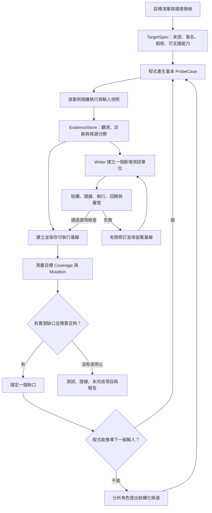

# Python 測試生成專案完善與重構計畫

日期：2026-09-21。基準：本機 commit `4257863`，另包含目前未提交的 Python 環境準備相關程式。本文是實作開始前建立的完整計畫；後續進度、驗收證據與未完成項目另見「完善實作進度_2026_09_21.md」。以下「現況」來自程式碼檢查與既有紀錄；驗收條件與新介面是待實作項目。

## 1. 建議方向與完成定義

把系統完善成「有證據、能增量改善、失敗可定位」的測試生成工具。優先建立可信的輸入與測量，再提高模型生成成功率；重構採逐步替換，沿用現有可用模組。

核心路徑：**選定可支援目標 → 建立可呼叫案例 → 受控執行取得證據 → 保存可執行測試基線 → 依一個實測缺口補測 → 驗證改善 → 更新結果**。

第一版完整交付應滿足：

1. 每筆探測都有呼叫前輸入、來源、執行狀態及可重播識別；能說清楚「實際傳了什麼」。
2. 支援範圍明示，未知型態／初始化需求不靠猜測強行執行。
3. 模型候選不會覆蓋已接受的行為證據；新增錯誤案例不會使可執行基線消失。
4. Coverage、mutation、Reviewer 各有獨立狀態；工具出錯不會沿用舊分數當成本輪成功。
5. 突變分數綁定目標、引擎、候選集合、測試及來源版本，能區分抽樣與完整測量。
6. 同一評估集、同一模型與相同環境下，能量測新版的成功率、品質及成本變化。

不將「所有 Python 專案零設定即可完全測試」列為本輪承諾。需真實 GUI、瀏覽器、跨程序協作或無法隔離初始化的目標，先列為需要 adapter／fixture 或不支援；不把略過項目算成通過。

## 2. 現況盤點：已有能力與真正缺口

最近完整批次為 `all_test_2026_09_20_17_31`：587 個目標、275 failed、302 dummy、2 stub、3 停滯、3 工具通過但審查未完成、2 無突變候選。失敗中 192 為 environment；191 在預檢停止且沒有模型請求。92 個目標發出 724 次模型請求。

這批使用較舊的 `review-v6 / quality-task-v2 / bug-fix-v3`。目前程式是 `review-v7 / quality-task-v3 / bug-fix-v4`，所以舊批次是問題基線，不能當作最新版實測成績。

| 已具備，應沿用 | 目前仍需處理 |
|---|---|
| AST、限定類別成員、相依與 caller 解析 | 型態與案例產生仍偏向純量，無法可靠建構所有容器與狀態 |
| 時間／隨機觀測不可當固定答案 | 可變參數在執行後才記錄，缺少呼叫前快照 |
| 模組預檢、工作階段內失敗快取 | 環境功能尚在工作區；批次應先彙整模組級障礙 |
| 正式 unittest／coverage／mutation 的執行防護 | Trace 與正式 runner 的檔案／網路政策仍有差異 |
| Trace 基線獨立驗證與保存到模型測試 | 首次可執行候選的正式基線保存仍受後續 mutation 成功影響 |
| Reviewer 引用檢查、快取與連續失敗停止 | 角色資格的格式能力與實際解題能力需要分開呈現 |
| 單方法 Bug Fixer、結構化品質回滾 | 整檔修訂、Tier 降階與多層重試仍可累積大量請求 |
| 內建突變的 baseline 與隔離錯誤檢查 | 候選截斷、外部範圍、文字解析、timeout 與分母需要統一 |
| 批次清單、終態與來源／測試 hash | UI 缺少直接閱讀逐筆輸入與採樣範圍的頁面 |

先前已修復的時間 oracle、品質缺口文字比較回滾、正式測試隔離與 Reviewer 模板拒絕，均屬需保持的回歸保護，不另列成尚未實作的功能。

## 3. 目標架構與分工

### 程式與模型的分工

| 工作 | 主責 | 模型的界線 |
|---|---|---|
| 簽名、型態結構、目標身分、caller literal | AST／確定性程式 | 不自行改寫已確認身分 |
| 通用值、literal／長度／布林／集合邊界 | 測資產生器 | 可建議補充候選，但不能宣稱答案 |
| 複雜欄位關係、初始化次序、Mock 配置 | 分析角色＋受限制 setup 契約 | 無證據的狀態保持假設 |
| 輸入快照、回傳值、例外、覆蓋及突變結果 | 執行工具 | 不接受模型自報分數或等效突變判定 |
| 測試組織、局部修訂 | Writer／Bug Fixer | 不修改被測來源，不移除通過案例 |
| 測試意見 | Reviewer | 意見需引用當前測試；與工具事實衝突時保留診斷 |
| 停止、回滾、預算、候選選擇 | 流程控制器 | 不讓模型決定是否略過品質要求 |

保留五個角色的語意分工，讓調用依證據與需要觸發。語意分析與品質分析可共用情境規劃服務，但仍區分輸入來源與時機；不新增第六個模型角色。

## 4. P0：先修證據與成果保存

### P0-E：環境與可測試性

- 接續現有 `src/environment/` 未提交功能，先驗證並整合，不另建第二套安裝流程。
- 批次先按模組與相同匯入環境預檢，讓同一項缺套件／初始化副作用以一個原因對應多個目標；保留逐目標狀態。
- 結果分為環境就緒、需要 fixture、匯入副作用阻擋、不支援綁定、來源解析失敗。判定依 AST、執行診斷及可用 adapter，禁止依函式名稱猜業務類型。
- Python executable、版本、相依環境指紋、來源版本、import roots 的穩定識別加入單目標執行資料；共享報告不輸出憑證與不必要私人路徑。
- 原應用相依依 requirements／lockfile／明確映射處理；不把內部模組錯誤當成需隨意安裝的外部套件。現有無 requirements 時同名安裝的行為，列為需要收斂的環境政策。

驗收：同一缺模組影響多函式時零模型請求；新分析修好相依後重新預檢；取消與重跑不互相污染；環境準備不在測試執行中改動套件。

### P0-T：Trace 的呼叫前快照與單案例隔離

現況：`dynamic_tracer.py` 在目標呼叫後才格式化 args；模組在案例迴圈之前只載入一次。list／dict 被修改，或模組全域計數器被改變時，觀測可能無法獨立重播。單個建構子失敗還會清空先前結果並返回。

改動：

1. 在建構子及目標執行前保存 `input_before`；執行後另存 `input_after`。constructor 參數亦同。
2. 使用型態明確、容量受限的值編碼器。不能任意呼叫物件的 `repr`、`__deepcopy__` 或序列化 hook；未知物件只能保存型態／診斷。
3. 每個獨立案例預設使用乾淨子程序，或具等價隔離保證的 worker。需要多步狀態的測試明確表示為同一案例的 setup＋operation sequence。
4. 一筆錯誤不刪除其他觀測；每筆保存 success、target-exception、setup-failed、blocked、timeout、not-started 等終態。
5. timeout 由父程序寫入該案例紀錄；逐筆落盤，避免整批 stdout JSON 因一個卡住的案例全部遺失。
6. 快照需處理同一可變物件被多個參數引用的情況；初版無法保存 alias 關係時明示不支援，不把兩個副本當成相同行為。

驗收案例：輸入 list 被 append、dict 被 pop、建構子修改傳入 list、模組 counter、可變 default、同物件重複傳參、成功→setup 失敗→成功、單筆無限迴圈。呼叫前資料保持不變，案例不互相污染，其他完成結果不遺失。

### P0-S：統一執行防護政策

現況：Trace 的部分一般讀檔及 loopback 連線可通過，但正式 runner 只允許必要 loader／traceback 讀取與特定 asyncio plumbing。Trace 某些非 SQLite 阻擋只拋例外，若被目標吞掉，可能沒有持續的違規紀錄。

改動：將共同政策與違規記錄抽成可共用模組，Trace、預檢、正式測試與突變均使用；按「工具載入」與「應用執行」區分必要能力。所有阻擋都留下 sticky 記錄，捕捉例外不會把案例變成可斷言證據。保留 loader、traceback、asyncio 的窄範圍例外，不放行任意 loopback。

本輪預設仍用 Mock 與獨立記憶體資源；任何新增真實暫存 I/O 能力另作版本化 opt-in adapter 與驗收，不透過放寬全域 guard 解決模型測試失敗。

驗收：同一 neutral fixture 在 Trace、正式執行、mutation baseline／mutant 的許可與阻擋結果一致；被吞掉的阻擋不能算通過。保留「程序內防護並非 OS sandbox」的界線。

### P0-B：分開可執行基線與最佳品質基線

現況：`bestCode` 主要在 mutation 完成後才接受。首次 unittest／coverage 已通過，若接著 mutation timeout，測試雖存在檔案中，仍可能未成為正式 accepted baseline。

改成兩份不可變快照：

- `executableBaseline`：測試、案例識別、執行輸出、coverage、source/test/setup hash、review 狀態。
- `qualityBestSnapshot`：在前者上綁定有效 mutation 結果與改善判定。

執行通過就先保存第一份；突變失敗記 `execution-passed / mutation-incomplete`，不宣稱完整通過，也不丟掉可重跑成果。回滾原子還原同一快照，不能組合跨候選最高分。

驗收：首輪突變逾時、外部引擎壞輸出、Reviewer 無效、下一輪模型失敗，均保留上一個可執行版本；source/dependency 變動後舊證據不能套用。

## 5. Trace 與測資產生的完整升級

### T1：逐筆案例與觀測契約

新增契約名稱為提案，實作時採正式版本號並同步 Python／TypeScript parser。

| 資料 | 最小內容 |
|---|---|
| `ProbeCase` | caseId、目標／來源 hash、參數 typed values、constructor/setup、origin、原因、關聯條件／缺口 ID、預算 |
| `ProbeObservation` | caseId、input_before／after、實際結果／例外、status、elapsed、阻擋操作、非確定性讀取、可斷言性與理由、環境指紋 |
| `ObservationOrigin` | caller 的來源位置、AST 條件行／規則、通用產生器版本，或模型 requestId；相同輸入多來源可合併來源清單 |

保留 initial 與 supplemental 分階段資訊，但不再只用整批 `input_source` 標記每一筆來源。失敗、blocked、timeout 也保留輸入；數值／字串／tuple／list 等使用明確型態，不能依 `repr` 字串猜回原值。

編碼需從 caller 擷取一路保持到 Python 執行：目前 literal 經一般 JSON 傳輸，tuple 可能變 list、整數字典 key 可能變字串，set／bytes 也不能直接傳遞。型態驗收必須包含這段傳輸，不只驗證產生器。原始可重播值與 UI 的短預覽分開，預覽截斷不代表完整值也必須丟棄；實體值仍受儲存與執行預算限制。

明確區分來源事實、執行觀測、模型候選、外部需求契約。Trace 的「observed result」不等於業務正確答案；報告提供 `oracleOrigin`，未知／不穩定值禁止精確斷言。

### T2：型態與條件導向測資

現況使用 annotation 字串包含比對；`list[int]` 可能走數字候選，`len(...)` 邊界可能直接產生字串。應改為靜態解析的型態樹，不 eval annotation、不以名稱猜領域。

| 波次 | 型態／情境 | 產生策略 |
|---|---|---|
| A | int、float、bool、str、None、Literal、Optional | 基本值＋來源 literal 邊界＋有效 caller；有限值與長度預算 |
| B | list、tuple、dict、set 與有限巢狀組合 | 空／一個／多個元素，保留容器型態；元素遞迴取有限候選 |
| C | TypedDict、dataclass、Enum、簡單自訂 class | 依靜態欄位、defaults、成員與可證明建構子產生；未知 factory 不執行 |
| D | 有狀態物件、async 相依、資料庫及其他邊界 | 透過受限制 fixture/setup adapter；無法建構則回報需求 |

每一型態先建立一組能有效呼叫的 baseline，再依分支／關係改變少數欄位。保留負面測資，但區分「刻意測試無效輸入」與「因缺乏 shape 而意外傳錯」。簽名錯誤只在明確 TypeError 行為案例中容許。

目前基本生成主要處理 required 參數；新增對 optional／keyword-only 參數的「省略採預設」與「明確指定」案例，才能探索由預設值掩蓋的分支。Union 分支先各取代表值，不能把 annotation 字串中含 int 當作整個參數都是 int。

參數關係如 `start <= end`、索引與容器長度、兩個欄位同時滿足條件，先處理可靜態證明的簡單關係；其餘交模型提出少量候選，仍需實測。避免完整笛卡兒積，對每參數候選數、容器大小、巢狀深度及總案例數設上限。

### T3：受限制的 setup／Mock 表達

一個案例可表達：安全 literal、可解析 constructor、白名單 fixture、dependency use-point patch、Mock 回傳／side_effect、async/context-manager 層級，以及有限狀態準備步驟。

模型只提議這些結構化配置；host 驗證目標、簽名、資源與相依身分後執行。禁止任意 eval、動態 import、shell、來源改寫或替換被測目標。自訂 constructor 和 setup 即使可解析，也要在受保護程序中執行。

相同 args 但不同 constructor／Mock／操作歷史必須是不同案例。不能把無 Mock Trace 的結果套用到另一個 Mock 配置；精確 assertion 需同一 setup 的執行或明確測試契約支持。

### T4：以覆蓋缺口回饋探索

先跑少量 caller／基本案例；每筆或每小批次取得實測行／分支，再挑未觸達條件探索。只有新案例能新增覆蓋、區分 survivor、驗證明確負面契約或補足不同狀態時，才提升為有價值的候選。

對新採用的可重播候選做獨立重跑，記錄差異；兩次相同只增加重播信心，不證明任意程式具有決定性。已偵測到時間／熵依賴仍必須明確控制，不能因碰巧相同而升格。

## 6. 分析、生成與修訂

### A1：統一目標與相依語境

以現有 `targetContract.ts`／AST 結果擴充 `TargetSpec`，固定 canonical module、qualified target、method kind、完整 signature、型態樹、constructor、相依使用點、來源位置與 hash。

同模組／跨模組 helper 檢索已有實作，應補檢索完整度與 unresolved reason，並依目前缺口選最相關部分。保持深度與提示預算；未知 re-export、動態 binding、MRO 不自動推定為事實。

### A2：分析角色輸出可執行的候選規劃

語意分析負責「還需要哪個輸入／setup」，品質分析負責「這一個實測缺口可怎麼區分」。共用情境資料結構，保留 hypothesis 標記。

每次最多提出少量案例，包含目標缺口 ID、參數／狀態／Mock、選擇理由與缺少資訊。缺乏資料可回 `needs-fixture` 或 `insufficient-context`，不能用空泛模板冒充工作。

簡單可由 AST／caller 解出的案例先走程式；模型只處理餘下需求。這是減少不必要角色調用，不改變生成物的品質要求。

### A3：由整檔重寫轉為增量測試

先保持目前 Writer 完整 unittest 輸出契約，要求一次只新增／修訂一個指定單位；host 以 AST 驗證其他已接受測試與 fixture 沒有變更。後續才引入新版本的 case-delta 契約，由 host 組合完整檔案。

case-delta 仍採純 Python code fence，內容為一個指定測試方法及明確限制的 imports／fixture 變更，不把整份測試包入 JSON。方法、fixture、imports 三者都需驗證修改範圍。若採其他傳輸形式，須另列 PROJECT_RULES、角色契約、parser 與資格探測的協同遷移，不能只改提示詞。

每個新增單位依序通過自身驗證、與基線合併後的整體執行、coverage／mutation 比較。新增案例失敗時可丟棄該候選，保留基線及具體失敗原因。

Bug Fixer 繼續限縮為可唯一定位的方法修復；fixture、import、多方法與結構問題交 Writer。可共用 code extraction／merge／scope validation 核心，不把兩角色混成無界自我修復。

### A4：Reviewer 的權限與資格

保留目前引用、模板拒絕、cache、未完成狀態及連敗停止。Reviewer 意見分成 host 可驗證矛盾、可重現測試缺陷、未驗證建議；只有有證據的阻擋才要求重寫。不能以 JSON 能解析就認定意見正確。

角色資格分開標示「契約可解析」「簡單 fixture 能執行／修復」「代表性任務達標」。現有 Writer probe 不代表 Reviewer 理解複雜 fixture；Reviewer／Bug Fixer 簡單 parser 資格也不能等同完整解題能力。

Reviewer 增加乾淨案例與刻意錯誤案例；Bug Fixer 在固定中性 fixture 上實際執行修復並確認其他測試未變。正式完整通過仍需要既定審查條件；若實驗關閉某角色，結果另列，不能混入正式成績。

### A5：以能力選策略，統一預算與停止

Tier 1–4 暫時保留 UI 相容；內部改由行為能力選擇 evidence-only、caller-partition、mock-assisted 等生成方式。模型參數量只是參考，不能取代實測資格、Context 預算、目標所需能力。

路由遷移必須保留現有資格邊界：未驗證模型的 Auto 僅能使用真實 Trace 的 deterministic fallback；證據不足或品質未過時保存結果並停止，不得轉用任何 LLM 角色。使用者手動選擇 Tier 時保留其選擇，所有模型產物仍通過完整檢查。角色契約或資格版本更新後，舊資格需重新評估，不自動視為符合新版本。

每目標設定一個總 wall-clock／模型請求／token／候選上限，再分配給各角色與工具。傳輸 retry、格式補正、候選修訂、Tier 切換全部消耗同一預算並保留原因。相同錯誤沒有新證據時不重新整檔生成。

品質無突變候選時可繼續補 coverage 缺口；mutation N/A 與 coverage 尚未完成分開。取消、來源變動、環境/API 類失敗不得藉策略降階隱藏。

## 7. 突變與覆蓋測量

### M0：先修測量正確性

目前可由程式碼確認的風險：

- 內建引擎只取候選前 30 個，回報 total 是已選數量，未回報全部可用候選數。
- 外部引擎收到整個檔案路徑，沒有相同的 qualified-function 範圍契約。
- 外部非零退出仍可能進入文字分數解析；缺少 survived 時預設 0，解析失敗亦有沿用先前 mutationScore 的路徑。
- 內建單 mutant timeout 與外層整個 mutation 階段使用相同秒數；內建 timeout 直接記 KILLED。
- survivor 轉成文字時丟掉部分候選位置／種類；同一行連鎖比較可能無法用文字唯一識別。
- `return None` → `return None` 等無實際 AST 改變的候選需要排除。
- 成功判斷使用四捨五入後的百分比，應改用精確計數；例如 199／200 顯示 100%，仍有一個 survivor，不能算全部偵測。

上述是靜態路徑風險，不代表已證明每個外部引擎執行都計錯分。

### M1：統一引擎結果契約

所有引擎回傳同一種 `MutationRun`，包含：

- engineId、版本、operatorSetVersion、sourceHash、testHash、environmentId、policyVersion。
- targetScope、scopeVerified、candidateSetId、samplingPolicy／seed。
- available、selected、executed、notRun、killed、survived、timeout、invalid、infrastructureError。
- 每個 mutant 的穩定 ID、AST 路徑／運算子索引、位置、原值與變更、執行診斷。
- baseline 狀態、是否完整、score 是否可用及不可用原因。

引擎退出碼必須按已驗證的 adapter 契約解讀；「偵測到 survivor 的約定退出碼」與工具崩潰分開。未知退出碼、格式缺漏、計數不一致、隔離證據缺失一律不能產生正式分數。每輪建立新的 result，禁止解析失敗沿用上一輪變數。

不要以 `total - survived` 推定 killed。優先使用可核對的結構化輸出；引擎只能提供文字時，限定已驗收版本與完整欄位，保存解析 fixture，拒絕猜測缺失數字。

### M2：一致的 target scope 與候選集合

內建與外部引擎都必須明示所測範圍。外部工具無法證明限制到所選函式時，標為 module-scope，只作獨立診斷，不能冒充函式分數；函式品質驗收使用能驗證 scope 的引擎。

定義函式 body、default／decorator／annotation／class setup 是否在範圍內；初版優先測函式 body，初始化另列。Coverage 使用明確來源身分與行／分支資料，避免只靠同檔名或顯示文字判定。

目前 `targetCoverage.ts` 從文字 report 以 basename／suffix 找列，並用 AST statement 行扣除 missing 推斷覆蓋。改為 coverage 原生 JSON／API 的實際 statements、executed／missing lines 及 arcs，再以 canonical source 和 target body 篩選；兩個同名 `utils.py`、docstring、多行語句與 decorator 必須分別驗收。這裡是來源支持的風險，尚未以各 coverage 版本實測重現全部情境。

先建立全集清單及 AST hash，去除完全無變更、重複和無法編譯的候選，保存排除原因；不以模型認為「等效」就刪掉分母。

互相比較的迭代先固定同一候選集合；需要擴充集合時產生新的 candidateSetId，重新測量基線，不把不同集合分數直接比較。顯示如「選測 30／可用 86；本輪已測 30」，抽樣 100% 只表示該集合全數偵測。

### M3：timeout、錯誤與穩定性

分開 baseline timeout、per-mutant timeout、stage deadline、target deadline。單 mutant 卡住要留下該 mutant 的終態並繼續可容許的剩餘工作；父程序超時仍保存已完成資料。

timeout 使用獨立狀態；若某引擎政策要把確定由突變造成的無限迴圈列為 timeout-kill，須有穩定原版基線、版本化規則與獨立計數，不能和基礎設施 timeout 混在一起。初版不把未釐清 timeout 宣稱為一般 killed。

原版不穩定、工具故障、隔離違規或未完成測量不得當成 killed。目標突變造成且由有效測試觀察到的例外，則可依引擎契約構成有效 kill；不能把所有非 AssertionError 一概視為工具錯誤。

無有效候選時為 N/A；正式品質分數只在所宣告集合的有效狀態均完整且錯誤已處理時給出。暫存進度可以呈現計數，不能把未測項目從分母消失後報完整通過。

### M4：用突變引導補測與提升效能

每輪選一個穩定 ID 的 survivor，提供原始與變更條件、相關來源、目前測試與可用觀測。先由規則產生區分輸入，必要時請分析角色提議；Writer 只新增相關案例，再驗證原版通過與該 mutant 被偵測。

優先測 survivor 和受新增案例影響的候選，最後在固定驗收集合重跑。完整測試 hash 改變時不得直接沿用舊 killed；選測快取只有在個別測試、fixture、來源、環境與相依身分可證明一致時使用，未知就全量重測。

先維持有限併發與可取消 worker，不在計分未穩定前增加大量並行引擎。模型請求仍依現有佇列；Python worker 可在隔離成立、資源上限明確後單獨評估併發。

### M5：統一品質政策與 scorecard

目前主流程完整工具成功要求 mutation 100%，但 fixture manifest 的部分門檻為 80／85／90；scorecard 又先拒絕 round-limit 等終態，因此只達 fixture 數值門檻仍可能失敗。應將「執行終止原因」「測量是否完整」「是否符合指定品質政策」「審查狀態」分成不同欄位。

建立共用、版本化的 `QualityPolicy`，由 pipeline、UI 與 scorecard 共用。預設正式模式保留既定嚴格要求；fixture 評估模式使用執行前固定的 manifest 契約，結果清楚標記，不能混稱 strict100 通過。現有每項 fixture 門檻不下調，舊報告也不能事後套新政策升級。

政策應保存 exact counts 與門檻；百分比只用於顯示。抽樣完成、無突變候選、review-incomplete 仍有各自狀態；任何 mode 都不能用 unknown／error 換取達標。驗收需含同一份 90 分結果在 fixture85 與 strict100 下得到不同且明示的評估，以及 199／200 不被四捨五入誤判。

## 8. 哪些地方可刪、可合併、應保留

### 可移除的正式未使用生成程式

經正式呼叫路徑搜尋，下列項目可列入清理 PR；刪除前再次確認 export、測試、打包與歷史工具引用。

| 項目 | 建議 |
|---|---|
| `unittestWriter.ts` 舊 `getTier1SystemPrompt`、`getTier1UserPrompt` | 移除舊生成入口，統一目前 evidence-bound Tier 1 |
| 同檔舊 `getTier4SystemPrompt`、`getTier4SelfRepairPrompt` | 移除未使用生成路徑；調整僅測舊 helper 的測試，保留正式修復行為測試 |
| `tierRouter.ts` 的 deprecated `canUseTierOneLlmFallback` | 確認無呼叫後移除相容別名 |
| `testRuleLibrary.ts` 的 `getTestRuleLibrarySummaryForPrompt` | 確認無正式使用後移除；保留目前 dispatcher 與規則庫 |

### 需相容遷移，不能直接當垃圾刪除

| 項目 | 建議 |
|---|---|
| `roles/legacy/mutantTriage.ts` | 正式流程未使用；歷史 reader 移至 compatibility，舊生成 prompt 可先退休 |
| `customApi.ts` 的 `mutant-triage-json` 分支 | 跟上述一起確認無新請求後退休，不單獨留下不可達 schema |
| `qualityAnalyst.ts` 的舊 `parseQualityTasks` | 與舊 Reviewer／Bug Fixer parser 統一置於版本化 compatibility 層 |
| 舊 Reviewer envelope／Bug Fixer JSON | 現行正式 parser 仍接受部分舊格式；先記錄相容分支命中並抽成 adapter，再決定退休版本。歷史報告保留 reader，不能直接刪除正式 fallback |
| 舊 `auto/small/large` 設定 | 遷移為與 UI 一致的策略設定；保存舊值轉換及明確說明 |

歷史保留期限依發行政策決定。未確認引用與資料需求前，不刪除使用者 output／log 或原始批次證據。

### 適合拆分／合併的高成本結構

| 現在的結構 | 問題 | 目標形狀 |
|---|---|---|
| `orchestrator.ts` 約 2,812 行 | 入口、路由、模型、驗證、突變、回滾、報告交織 | 薄入口＋target pipeline＋generation＋quality evaluator＋artifact/report service |
| 巢狀輪數／Tier／格式／修訂／傳輸重試 | 請求放大，難判斷剩餘成本 | 一個 RequestBudget／RetryPolicy，按失敗分類決定下一動作 |
| 多個 `best*` 變數一起維護 | 容易不同版本資料混用 | 型別明確、不可變的 CandidateSnapshot |
| TypeScript 與 Python 重複定義證據欄位 | schema 漂移或欄位被丟掉 | 共用契約規格＋雙端解析／相容性測試 |
| `dynamic_tracer.py` 同時產值、執行、防護、序列化 | 很難單獨擴充型態／隔離 | value codec、input planner、probe runner、runtime policy 分離 |
| AST extractor 與 tracer 分別辨識條件 | 條件與型態語意易漂移 | 由 AST 產出同一份 condition/type facts，測資與提示詞共用 |
| Trace 與正式 runner 各自處理安全操作 | 相同案例在不同階段結果不一致 | 共用 policy／違規事件，保留階段所需窄例外 |
| mutation 判斷與外部 regex 寫在 orchestrator | 引擎語意不一致 | 每引擎 adapter＋統一驗證器，核心不讀原生文字 |
| 內建候選枚舉與 mutation 套用各有相似 if 鏈 | 靠遍歷 index 對齊，容易漂移 | 一份 operator registry＋AST 路徑，枚舉與套用共用規則 |
| 部分測試自行複製 production survivor parser | 測試可能只證明副本正確 | 移除測試內副本，直接測正式 adapter 的正反輸出 |
| 以自然語言拼接品質狀態與報告 | 診斷與顯示耦合 | 結構化事件作權威，Markdown／UI 作 projection |
| scorecard 讀 Markdown 再合併 journal | 人類排版影響評分且來源分散 | 新版讀同一 schemaVersion 的 run result；歷史 Markdown parser 留在相容層 |
| `runSpawn` 與環境安裝 runner 部分重複 | timeout、取消、output limit 行為分散 | 共用底層 process executor，保留安裝鎖與不同執行政策 |
| SidebarProvider 同時處理 UI 訊息與模型探測 | UI 難測，供應商流程重複 | typed message router＋qualification service＋view model |

拆檔以責任和可測試邊界為準，不以檔案數或行數作成果。現有 `ExecutionContext`、`testCandidatePipeline` 等應重用，避免新增第二套狀態機。

### 明確保留

AST 目標／import 綁定、Trace 證據檢查、程序執行防護、獨立 Trace baseline、coverage 與 mutation baseline、同版本 hash、scope 限制、回滾、取消與超時、Reviewer 未完成狀態、SecretStorage、批次清單，以及正反回歸測試。

`fewShotExamples.ts` 仍有正式 Writer 使用；`mutatest/mutmut` adapter 仍可到達。它們可整併或降低預設依賴，不應直接稱為死碼。確定性 Trace 備援也有離線／未合格模型用途，需保留獨立 provenance。

### 本輪不優先投入

不先新增模型角色、向量資料庫、無限制隨機輸入、整批並行模型請求、複雜 agent framework 或整套 UI 重寫。這些需要在核心可信與瓶頸量測之後，才有依據決定是否值得。

## 9. 分階段交付順序

工期為單一熟悉專案的開發者之初步規劃，不是承諾；模型／實驗室環境等待另計。建議約 6–10 週，以每階段驗收結果調整後續範圍。

| 階段 | 優先序／依賴 | 交付物 | 完成條件 |
|---|---|---|---|
| 0：凍結基準與支援範圍 | P0，先做 | 固定 17 份現有 corpus、五類小批次、環境與模型身分、失敗分類表 | 可重現同一版本；舊／新契約與 fallback／LLM 成績分開 |
| 1：環境、輸入快照與基線保存 | P0，依階段 0 | P0-E/T/S/B；mutation 壞結果不計分的止血修正 | 可變輸入不失真、失敗不清空成果、錯誤／隔離不假通過 |
| 2：基本型態與逐筆 Trace | P1，依階段 1 | ProbeCase／Observation、型態 A/B、案例列表與逐筆狀態 | 新增型態端到端通過 AST→Trace→測試→mutation 對應門檻 |
| 3：分析候選與增量 Writer | P1，依階段 2 | setup 初版、單缺口任務、局部新增與統一預算 | 無關測試保持不變；錯誤新增可丟棄；相同無效策略會停止 |
| 4：突變統一與品質迭代 | P1，階段 1 後可先抽 adapter，最後與 3 整合 | MutationRun、固定候選集合、scope、timeout、N/A 解耦 | 候選與分母可核對；不跨 scope／集合誤比；無突變仍能補 coverage |
| 5：複雜 fixture 與能力資格 | P2，依 3/4 | 型態 C/D、Mock／async adapter、角色代表性資格 | 複雜案例保持相同證據／隔離要求；未知狀態有明確出口 |
| 6：架構與相容清理 | 貫穿前述階段，避免一次大改 | 移除舊生成 helper、compatibility 層、薄 orchestrator、typed UI | 行為／事件序列回歸不變；舊報告仍可讀；新路徑唯一 |
| 7：實驗室驗收與交付 | 依 1–6 的選定支援範圍 | 對照實驗、scorecard、報告與操作說明 | 達到固定 gate；各類改善／退步均可追溯，無隱藏分母變更 |

階段 1–3 是第一個可交付里程碑；不必等所有自訂物件與外部引擎支援完成才交付改善。

## 10. 測試與實驗設計

### 回歸與模型實驗分開

固定回覆／中性 fixture 的整合測試，驗證 host 流程是否正確；真實模型實驗才衡量生成品質。兩者分開報告，不能以 parser 或 mock-provider 通過代替模型驗收。

現有 manifest 有 17 個 fixture。建議分批擴充到至少 40 個開發 fixture，另保留至少 10 個不放入 few-shot／規則調整資料的保留評估案例。數量是規劃目標，不是目前已完成。

| 類別 | 必須覆蓋的正反案例 |
|---|---|
| Trace 身分與快照 | 可變輸入、alias、constructor 修改、全域／default 狀態、setup 失敗、timeout 保留其他結果 |
| 型態與形狀 | list[int]、dict/TypedDict、Optional、Literal、巢狀容器、bytes、tuple；不支援型態的明確診斷 |
| 呼叫與綁定 | positional-only、keyword-only、instance/static/class/property、同名方法、relative import |
| Oracle | 時間／隨機只作診斷、明確 mock、截斷／循環物件、相同輸入矛盾結果、不用型別猜 expected |
| 執行防護 | loader/traceback/async 正常；一般檔案/網路/SQLite 越界與吞例外均不得通過 |
| 增量測試 | 新案例錯誤、fixture 污染、scope 越界、Reviewer 矛盾、mutation 中斷仍保留基線 |
| Mutation | >30 候選、no-op、連鎖比較 ID、同檔多函式、非零 exit、缺欄位、timeout、N/A、跨輪壞輸出 |
| Coverage／政策 | 同名不同路徑、docstring、多行 statement、精確計數與顯示四捨五入、strict100／fixture policy |
| 批次 | 重複來源、noise／backup 排除、預檢聚合、取消重跑、掃描失敗與缺報告 |

每增加一種 Trace 輸入能力，至少加入中性 corpus，驗證 AST／Trace 實際輸入、生成 unittest 可執行、coverage／mutation 達該 fixture 原定門檻；不只測 helper 回傳正確。

### 固定條件的對照實驗

1. A：目前穩定版本＋目前模型，作為基準。
2. B：新版流程＋相同模型，測流程改善。
3. C：目前流程＋另一個已設定且允許使用的模型，測模型影響。
4. D：新版流程＋另一模型，檢查交互影響。

固定來源、Python／套件、範圍、品質門檻、資源預算及候選集合政策。先用五類小批次，再跑完整 corpus；每條件建議至少三次獨立執行並報分布，小樣本只作工程訊號。沒有第二模型時先做 A/B，不能據此宣稱模型比較結果。

不得混合手動 Tier 與 Auto、模型、供應商、fallback 與 LLM、舊／新來源，或只挑每次最高分。所有原始結果與失敗樣本都保留。

### 必報指標

| 指標 | 分母／解讀 |
|---|---|
| 環境就緒率 | 所有一般目標；環境阻擋另列，dummy/stub 不混入模型成功率 |
| 首次可執行率 | 已就緒且進入該生成模式的目標；不靠後續修復補成首次成功 |
| 完整通過率 | 固定支援範圍下所有應評目標；另列審查未完成、無候選與部分成果 |
| 有效探測率 | 執行案例中取得可用／可重播觀測的比例；blocked／setup failure 另列 |
| 覆蓋改善 | 同一來源／目標的行與分支缺口集合變化 |
| 突變改善 | 同引擎／候選集合／範圍的 killed 與 survivor 身分變化 |
| 模型有效率 | 每角色的有效格式、執行有效候選、實際改善數，三者分開 |
| 成本 | 每目標 logical request、候選、修訂、輸入 tokens（估計與實際分開）、elapsed 中位數與 p95 |
| 成果保留率 | 後續失敗時，先前可執行基線是否仍完整存在 |

硬性驗收：既有安全／證據反例零假通過；固定 corpus 的既定門檻不降低；錯誤／未知分數不當成功；舊案例不因重構退步；所有產物可核對身分。效能目標先以基準測量後預先訂定，例如請求中位數降低 30%；這是實驗目標，不能用降低品質門檻交換。

CI 保留型別、lint、build、TypeScript／Python 回歸、Webview 語法及密鑰掃描；補 Windows 與實驗室實際 Python 組合。外部突變引擎在其支援環境以真實工具驗收，替身測試不宣稱完成該引擎相容性。

## 11. 使用者介面與交付內容

結果頁新增逐筆 Trace 表：輸入前值、輸入後變化、來源、setup、回傳／例外、可斷言性、原因及耗時。可開啟 caseId 對應紀錄，匯出可重播案例；不直接把模型建議顯示成已執行事實。

進度依環境／探測／生成／執行／coverage／mutation／review 分開。突變顯示目標 scope、引擎、已選／可用／已完成數量；可執行但品質未完成的成果可下載，明示限制。

UI 中「Tier 1 填空」「34–70B」等舊文字與 `package.json` 的 `small/large` 設定需與實作一致；保留設定遷移，勿讓同一選項代表不同語意。

批次前提供來源 inclusion/exclusion 預覽，預設不把 output、noise、備份重複目標混入正式評估；使用者可明確選擇納入。報告同時列原始目標數、可支援目標數、環境阻擋及各結果，不隱藏分母。

## 12. 第一批可直接開工的工作清單

| 順序 | 工作 | 主要位置 | 驗收重點 |
|---|---|---|---|
| 1 | 建基準快照與正反 fixture；確認環境工作區修改 | `test/fixtures/`、`src/environment/` | 基準可重跑，既有修改不被覆蓋 |
| 2 | Trace 呼叫前 snapshot 與逐筆 status | `dynamic_tracer.py`、`evidenceContracts.ts` | list/dict/constructor 變動可追查 |
| 3 | 案例隔離、錯誤不清空與逐筆落盤 | tracer／process runner | counter、setup error、timeout |
| 4 | 共用 runtime policy 與 sticky violations | tracer／generated runner | 四階段一致且吞例外不通過 |
| 5 | mutation 前保存 executable baseline | orchestrator／journal | 首輪 mutation timeout 不丟可用成果 |
| 6 | 外部突變格式／退出碼／計數止血 | mutation adapter／orchestrator | 壞輸出不沿用舊分數 |
| 7 | 型態樹＋容器 baseline | AST／input planner | list[int] 不傳純數字、len 維持容器型態 |
| 8 | 突變集合、ID、scope 與 timeout 統一 | basic runner／mutation 模組 | >30、連鎖比較、N/A、跨引擎範圍 |
| 9 | Writer 單案例增量與全目標預算 | candidate pipeline／roles | 不改壞既有測試、請求數可預期 |
| 10 | 逐筆輸入 UI、五類小批次 A/B | UI／scorecard | 使用者看得懂證據與未完成原因 |

每一項以獨立小變更驗收，再合併；任何正式契約改版需同步 parser、Python 工具、資格版本、schema、PROJECT_RULES、文件及測試。不要同時改輸入生成、模型、提示詞與評分規則後只看總分，否則無法定位改善來源。

## 13. 程式碼與紀錄依據

下列連結對應本次檢查版本；後續重構可能改變行號。

- [既有完整批次](../../test/result/all_test_2026_09_20_17_31/batch_manifest.json)
- [既有批次修復與已完成事項](../docs/完整批次修復_2026_09_20.md)
- [Trace 輸入產生與型態判斷](../python_scripts/dynamic_tracer.py:651)
- [Trace 逐案例執行與執行後參數記錄](../python_scripts/dynamic_tracer.py:1007)
- [Trace 操作限制](../python_scripts/dynamic_tracer.py:106)
- [正式 runner 的操作政策](../python_scripts/generated_test_runner.py:86)
- [補充純量輸入產生](../src/tier/supplementalProbeInputs.ts:70)
- [現有證據資料契約](../src/pipeline/evidenceContracts.ts)
- [主控流程](../src/orchestrator.ts:1131)
- [首次基線接受與回滾](../src/orchestrator.ts:2528)
- [外部突變執行與解析](../src/orchestrator.ts:2403)
- [內建突變候選截取與 baseline](../python_scripts/basic_mutation_runner.py:417)
- [內建突變狀態與 timeout](../python_scripts/basic_mutation_runner.py:521)
- [引擎命令 adapter](../src/mutation/mutationExecution.ts:45)
- [候選修訂流程](../src/pipeline/testCandidatePipeline.ts)
- [目前角色契約](../src/roles/roleContracts.ts)
- [角色資格探測](../src/llm/roleQualification.ts:56)
- [環境準備現有工作](../src/environment/pythonEnvironmentSetup.ts:115)
- [現有 corpus 與品質門檻](../test/fixtures/python/manifest.json)
- [Tier 路由](../src/tier/tierRouter.ts)
- [舊生成 helper 所在檔](../src/roles/unittestWriter.ts)
- [歷史突變分流相容程式](../src/roles/legacy/mutantTriage.ts)
